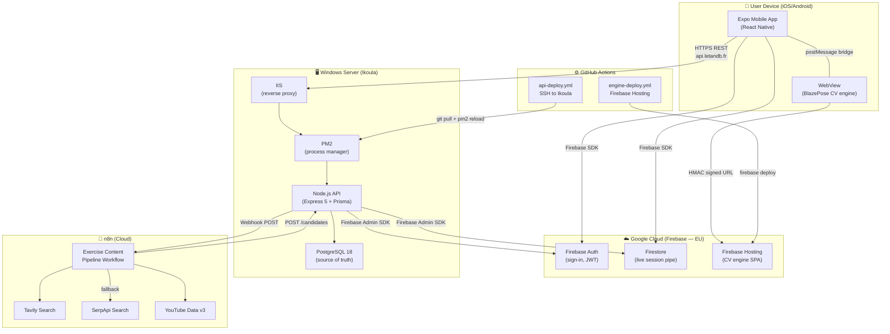

# LetAndB — Available Architecture Reference

This document describes the production architecture of LetAndB and can be used as a reference for building similar mobile + AI projects.

---

## Architecture Overview

---

## Key Architectural Principles

### 1. **Separation of Concerns**
- **WebView (CV engine)** runs only on-device — never communicates with the API
- **API** is the only writer to PostgreSQL — no direct DB access from mobile/WebView
- **Firebase Firestore** used only for real-time session pipe — all persistent data in PostgreSQL
- **n8n** handles async workflows (crawl, candidate extraction) — API acts as task orchestrator

### 2. **Zero-Trust Security**
- All API requests authenticated via Firebase JWT (issued by Firebase Auth)
- WebView URLs signed with HMAC-SHA256 (prevents token tampering)
- Service credentials for n8n/admin workflows stored in `.env` on Ikoula only
- n8n credentials never stored in code — attached via n8n UI (security by design)

### 3. **Automatic Deployments**
- Every push to `master` triggers GitHub Actions
- Engine deploys to Firebase Hosting via `firebase deploy`
- API deploys to Ikoula via SSH + git pull + pm2 reload
- Database migrations (`prisma migrate deploy`) run automatically on each deploy
- Seed data injected via `prisma db seed` (only on Ikoula via GitHub Actions, not locally)

---

## Service Details

### Firebase (Google Cloud EU)

| Service | Purpose | Key Settings |
|---------|---------|---|
| **Firebase Auth** | User sign-in (email/Google/Apple) | JWT token issued on login, sent with every API request |
| **Firebase Hosting** | Serves WebView HTML/JS (CV engine) | EU data residency, auto-deploys from GitHub Actions |
| **Firestore** | Real-time session data pipeline | Used only during active sessions; everything else in PostgreSQL |

**Setup required:**
- Register Web App for admin tools (separate from mobile app for development/staging)
- Enable Email/Password, Google Sign-In, Apple Sign-In authentication methods
- Set up Firestore security rules to allow authenticated users to write session data only
- Generate Firebase service account JSON for backend (stored in `.env` on Ikoula)

**Cost estimates:**
- Firebase Auth: ~free tier (up to 50K users/month free)
- Firebase Hosting: 1 GB storage free, overage ~$0.18/GB
- Firestore: 50K read/write/delete free per day, overage ~$0.06 per 100K ops

---

### Ikoula Windows Server (VPS)

| Component | Details |
|-----------|---------|
| **OS** | Windows Server 2019+ |
| **Runtime** | Node.js 22 LTS (installed via installer) |
| **Process Manager** | PM2 (npm global, auto-start via `pm2 startup`) |
| **Reverse Proxy** | IIS (binds to port 80/443, forwards to PM2 port 3000) |
| **Database** | PostgreSQL 18 (EDB Windows installer) |
| **SSL/TLS** | Win-ACME 2.2.8 (auto-renews Let's Encrypt certificates) |

**Connectivity:**
- API endpoint: `https://api.letandb.fr` (or `https://dev.letandb.fr` for staging)
- IIS listens on `0.0.0.0:80/443` (public)
- PM2 Node.js service listens on `127.0.0.1:3000` (local only)
- PostgreSQL listens on `127.0.0.1:5432` (local only, firewalled)

**Deployment process:**
1. GitHub Actions SSH into server via `appleboy/ssh-action`
2. Runs: `git pull` → `npm install` → `prisma migrate deploy` → `prisma db seed` → `pm2 reload`
3. Uses SSH key stored in GitHub Actions secrets
4. **Critical gotcha**: `cmd.exe` script execution doesn't halt on error like bash `set -e` — added explicit `if errorlevel 1 exit /b 1` checks

**Cost estimates:**
- Ikoula VPS: ~€15–25/month depending on spec (includes Windows Server license)

**Setup checklist:**
- [ ] Install Node.js 22 LTS from https://nodejs.org
- [ ] `npm install -g pm2` then `pm2 startup` to enable auto-start
- [ ] Install Git from https://git-scm.com/download/win
- [ ] Install PostgreSQL 18 (EDB installer) with data directory on a dedicated drive
- [ ] Create database `letandb` and user `letandb_user` (see `ikoula-db-setup.md`)
- [ ] Clone repo: `git clone https://github.com/iadimweb/LetAndB.git letandb` to `C:\` or `F:\`
- [ ] Copy Firebase service account JSON to `credentials/` folder
- [ ] Set up `.env` with database credentials, Firebase keys, API secrets
- [ ] Set up IIS reverse proxy to forward requests to `http://127.0.0.1:3000`
- [ ] Install Win-ACME and configure Let's Encrypt auto-renewal

---

### n8n Workflow Engine (Cloud)

**Instance:** Damie's self-hosted n8n on `https://n8n.srv1195018.hstgr.cloud/`

**Current workflow:** "LetAndB — Exercise Content Pipeline Crawl" (id: `OvRwqevMMHjUFM9h`)

**Workflow shape:**
1. **Trigger:** Nightly schedule (`0 2 * * *` UTC) or manual webhook
2. **Loop:** Iterate over pain areas (e.g., lower_back, neck, shoulder, hip, knee)
3. **Search (parallel):**
   - **Tavily Search** (primary, HTTP Bearer Auth)
   - **SerpApi Search** (fallback if Tavily fails, pre-built n8n credential type)
   - **YouTube Data v3 Search** (always, HTTP query auth with API key)
4. **Deduplicate & extract** candidate exercises from results
5. **Loop & POST:** For each candidate, `POST /api/v1/admin/content-pipeline/candidates` to Ikoula API
6. **Signal completion:** `PATCH /api/v1/admin/content-pipeline/crawl/:jobId` to mark job done

**Credentials required:**
- Tavily API key (`httpHeaderAuth`)
- SerpApi key (use n8n's built-in `serpApi` credential type, not generic HTTP)
- YouTube Data v3 API key (`httpQueryAuth`)
- LetAndB API ServiceCredential (stored in `.env` on Ikoula, manually attached to n8n workflow)

**Key gotcha:** n8n has no credential-listing API (security by design) — all credentials must be attached manually via the n8n editor UI. When constructing workflows, use explicit node references like `$('NodeName').item.json.field` instead of `$json.field` to avoid chaining issues.

**Cost estimates:**
- n8n Cloud: $20–80/month depending on execution hours and workflow complexity
- Tavily: $9/month for 1K requests/day
- SerpApi: ~$10/month for 100K requests/month
- YouTube Data v3: free tier includes 1M units/day

---

## Development Environment & CI/CD

### GitHub Actions Workflows

#### `engine-deploy.yml`
- **Trigger:** Any push to `master`
- **Steps:**
  1. Checkout code
  2. Install Node.js + npm dependencies
  3. `npm run build` (Vite TypeScript → JavaScript)
  4. `firebase deploy --only hosting --project let-and-b-dev`
- **Output:** Updated engine SPA at `https://let-and-b-dev.web.app`

#### `api-deploy.yml`
- **Trigger:** Any push to `master`
- **Steps:**
  1. Checkout code
  2. SSH into Ikoula server
  3. `git pull` (fetch latest code)
  4. `npm install` (install dependencies)
  5. `npm run typecheck` (verify TypeScript)
  6. `npx prisma migrate deploy` (run schema migrations)
  7. `npx prisma db seed` (inject seed data)
  8. `pm2 reload` (restart Node.js service)
- **Output:** Updated API at `https://dev.letandb.fr/api/v1`

**GitHub Actions secrets required:**
- `FIREBASE_SERVICE_ACCOUNT`: JSON content of the Firebase service account file
- `SSH_PRIVATE_KEY`: SSH private key for Ikoula access
- `SSH_HOST`: Ikoula server IP/hostname
- `SSH_USERNAME`: SSH username (typically `Administrator`)

---

## Data Flow

### User Authentication
1. Mobile app calls Firebase Auth (email/password/Google/Apple sign-in)
2. Firebase returns JWT token
3. Mobile app includes JWT in `Authorization: Bearer <token>` header for all API calls
4. API validates JWT via Firebase Admin SDK
5. Custom Firebase claims checked for `premium: true` status

### Active Session (Real-time)
1. Mobile app fetches program + exercises from API (REST)
2. App opens WebView with HMAC-signed URL to Firebase Hosting engine
3. Engine validates HMAC token (prevents URL tampering)
4. During session: CV detects pose landmarks (~30fps), sends to mobile via `postMessage` bridge
5. Mobile app writes pose keypoints to Firestore (real-time sync)
6. Session ends: mobile app buffers all landmark frames locally
7. Background upload: flame frames POST to `/api/v1/pose-keypoints` (async, fire-and-forget)

### Background Processing (n8n)
1. Admin user triggers "Search for exercises" in Exercise Manager
2. API creates `CrawlJob` record in PostgreSQL, returns job ID
3. API calls n8n webhook `POST /webhook/letandb-crawl` with job ID
4. n8n runs workflow: search (Tavily → SerpApi → YouTube) → dedupe → loop candidates
5. For each candidate: `POST /api/v1/admin/content-pipeline/candidates` (API creates draft Exercise)
6. Workflow signals completion: `PATCH /api/v1/admin/content-pipeline/crawl/:jobId {status:'completed'}`
7. Admin can review candidates in Exercise Manager, edit/approve, publish to PostgreSQL

---

## Scaling Considerations

### Current Bottlenecks
- **PostgreSQL:** Single-server Ikoula instance; would need read replicas + primary failover for multi-million-user scale
- **Firebase Firestore:** Adequate for current session throughput; switch to Realtime Database if latency critical
- **n8n:** Shared instance; dedicated deployment recommended for >1K jobs/day
- **Ikoula:** Single VPS; would need load balancer + multiple API instances behind it

### Growth Path
1. **<100K users:** Current setup adequate; monitor database size/CPU
2. **100K–1M users:** Add PostgreSQL read replicas, API behind HAProxy/ALB, separate n8n instance
3. **>1M users:** Multi-region Firebase Firestore, sharded PostgreSQL, API auto-scaling, CDN for static assets

---

## Monitoring & Observability

### Sentry (Error tracking)
- Captures mobile app crashes, unhandled exceptions
- Captures backend API errors, database query failures
- Issues grouped by error type, severity, user count

### Firebase Analytics
- Event tracking (sign-in, session start/end, exercise completion)
- User funnel analysis
- Performance metrics (app crash rate, session length)

### PM2 (Process monitoring)
- Watches Node.js service health
- Auto-restart on crash
- Accessible via `pm2 status` / `pm2 logs` on server

### Win-ACME SSL Certificates
- Auto-renews Let's Encrypt certificates 30 days before expiry
- Run task scheduled to test renewal regularly

---

## Security Practices

### Secrets Management
- Firebase service account JSON: stored in `.env` on Ikoula (not in code)
- n8n API credentials: stored in n8n vault (not in code)
- GitHub Actions secrets: encrypted, only visible to CI/CD
- Database password: stored in `.env` only, locked to localhost

### API Security
- All endpoints require Firebase JWT authentication (except health check)
- Rate limiting on public endpoints (prevent brute force)
- HTTPS enforced (redirect HTTP → HTTPS)
- CORS configured to allow only trusted origins
- Input validation on all POST/PUT/PATCH endpoints

### Database Security
- PostgreSQL accepts connections only from `127.0.0.1` (no external access)
- Separate `letandb_user` with minimal privileges (no superuser)
- Regular backups (via Ikoula hosting provider)
- Connection pooling via Prisma (prevent connection exhaustion)

---

## Cost Summary

| Service | Monthly Cost | Notes |
|---------|--------------|-------|
| **Firebase** | ~$30–50 | Auth (free tier) + Hosting + Firestore usage |
| **Ikoula Server** | €15–25 | VPS with Windows Server license |
| **n8n Cloud** | $20–80 | Execution hours + complexity |
| **Search APIs** | ~$20 | Tavily + SerpApi + YouTube (free tier) |
| **SSL/DNS** | ~€5–10 | Domain + Let's Encrypt (free, renewal labor) |
| **Total** | ~€80–200/month | All-in for production |

---

## Deployment Checklist for New Projects

### Preparation
- [ ] Create GitHub repository
- [ ] Set up Firebase project (create Web + iOS + Android apps)
- [ ] Request Ikoula VPS (Windows Server 2019+)
- [ ] Set up n8n instance (self-hosted or cloud)
- [ ] Procure domain name, point DNS to Ikoula server

### Firebase Setup
- [ ] Register Web app for tools (separate from mobile app)
- [ ] Enable Email/Password, Google, Apple authentication
- [ ] Create Firestore database (EU region)
- [ ] Generate service account JSON
- [ ] Configure Firestore security rules
- [ ] Deploy engine SPA to Firebase Hosting

### Ikoula Server Setup
- [ ] Install Windows Server OS
- [ ] Install Node.js 22 LTS
- [ ] Install PM2 and configure auto-start
- [ ] Install Git
- [ ] Install PostgreSQL 18
- [ ] Create database and application user
- [ ] Clone GitHub repository
- [ ] Create `.env` with all secrets
- [ ] Set up IIS reverse proxy (port 80/443 → 127.0.0.1:3000)
- [ ] Install Win-ACME and configure SSL certificate renewal

### GitHub Actions Setup
- [ ] Store Firebase service account JSON in `FIREBASE_SERVICE_ACCOUNT` secret
- [ ] Store SSH private key in `SSH_PRIVATE_KEY` secret
- [ ] Store Ikoula hostname in `SSH_HOST` secret
- [ ] Store SSH username in `SSH_USERNAME` secret
- [ ] Push to `master` to trigger workflows

### n8n Workflow Setup
- [ ] Create workflow for background jobs
- [ ] Attach external API credentials via UI
- [ ] Configure webhook endpoint for API callbacks
- [ ] Test workflow manually
- [ ] Schedule workflow (or leave webhook-triggered)

### Post-Deployment
- [ ] Monitor GitHub Actions for successful deploys
- [ ] Verify API is accessible at `https://api.yourdomain.com`
- [ ] Verify engine SPA is accessible at Firebase Hosting URL
- [ ] Test end-to-end flow: sign-in → start session → submit results
- [ ] Configure Sentry error tracking
- [ ] Set up monitoring alerts (PM2, database size, error rate)

---

## Common Issues & Solutions

### "CI green but server stale"
**Problem:** GitHub Actions reports success, but Ikoula is still running old code.
**Root cause:** `cmd.exe` doesn't halt on error like bash `set -e` — failing steps (git pull, build) don't stop the script, later steps run against stale code anyway.
**Solution:** Add explicit `if errorlevel 1 exit /b 1` checks after every step in SSH scripts. Verify deploys via direct SSH inspection (check `git log`, `pm2 status`, fresh logs).

### "PayloadTooLargeError on pose-keypoints"
**Problem:** Long sessions (10+ mins at 30fps) exceed JSON payload limit.
**Root cause:** Clients buffer all landmark frames locally, then POST entire session at once (~18MB for 10 mins).
**Solution:** Increase Express JSON limit to 100MB. Optionally, clients can batch frames (upload every N seconds instead of at end).

### "ERR_TOKEN_INVALID on session start"
**Problem:** WebView engine rejects HMAC token immediately after load.
**Root cause:** Permission dialogs (camera/mic) delay WebView rendering, eating into 60s token TTL before the page even loads.
**Solution:** Generate token only after permissions resolve, not at mount. Increase TTL to 120s+ as buffer.

### "Unique constraint failed on exercise name"
**Problem:** n8n retry sends duplicate exercise candidate; API rejects with P2002.
**Root cause:** No idempotency handling in `createExercise()`.
**Solution:** Catch P2002 (unique constraint), fetch existing exercise by name, return it idempotently.

---

## References

- **Full docs:** See `/docs` folder in repository
- **Architecture deep dive:** `architecture-overview.md`
- **Ikoula setup:** `ikoula-db-setup.md`
- **Dev environment:** `dev-environment-startup.md`
- **Exercise management:** `exercise-management.md`
- **SSL renewal:** `ssl-renewal-procedure.md`

---

## Questions or Adaptations?

This architecture is battle-tested on LetAndB production. Adapt as needed for your project:
- **Different mobile framework?** Replace Expo with native iOS/Android; Firebase Auth, Firestore, Hosting remain same.
- **Different backend?** Keep PostgreSQL + n8n; replace Express API with Django/FastAPI/Go. SSH deployment pattern still works.
- **Different search service?** Replace Tavily/SerpApi with Perplexity/Google Custom Search; n8n workflow shape unchanged.
- **No background jobs?** Skip n8n; use Prisma event hooks or PM2 cron jobs for async tasks.

---

**Last updated:** 2026-10-02  
**LetAndB GitHub:** https://github.com/iadimweb/LetAndB
